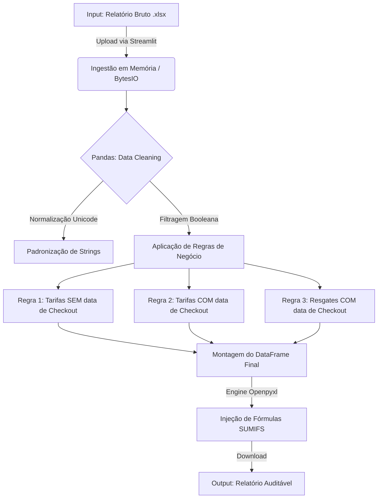

# 🚀 Financial Operations ETL: From Product Pain to Data Automation

> Um pipeline de automação de dados "End-to-End" desenvolvido para eliminar gargalos no backoffice financeiro, reduzindo o tempo de fechamento de 30 minutos para 5 segundos.


## 💼 Contexto: A Visão de Produto & O Problema
Atuando na interface entre Produto e Operações, identifiquei um padrão crítico de ineficiência no processo de faturamento mensal de custos corporativos. O time financeiro realizava um processo manual de **Extração, Transformação e Carga (ETL)** via Excel que apresentava três dores principais:

1.  **Alta Latência:** O processo consumia horas críticas durante o período de fechamento (SLA).
2.  **Risco Operacional:** A manipulação manual de milhares de linhas era propensa a erros de cópia e quebra de referências.
3.  **Falta de Padronização:** Dificuldade em manter regras de negócio complexas (segregação de tarifas vs. resgates) de forma consistente.

**O Desafio:** Como automatizar regras de negócio híbridas garantindo 100% de precisão contábil e auditoria, sem exigir conhecimentos de programação do usuário final?

## 💡 A Solução: Abordagem Data-Driven
Desenvolvi uma aplicação web **Full-Stack** (Python + Streamlit) que atua como um middleware de processamento. A ferramenta ingere os dados brutos, aplica a lógica de negócios em memória e devolve o dataset estruturado e formatado.

### Arquitetura do Pipeline de Dados
*Devido a políticas de compliance e privacidade de dados, a arquitetura lógica abaixo substitui screenshots de planilhas reais.*



## 🛠️ Tecnologias e Engenharia de Dados

Este projeto demonstra a aplicação prática de conceitos de Ciência de Dados para resolver dores de negócio:

* **ETL & Wrangling (Pandas):** Limpeza de dados, tratamento de valores nulos e categorização baseada em múltiplas condições.
* **Processamento em Memória (`io.BytesIO`):** Manipulação de arquivos sem gravação em disco, garantindo segurança e performance.
* **Automação de Excel (`openpyxl`):** Ao contrário de scripts simples que apenas exportam valores, este projeto manipula o XML do Excel para preservar estilos e injetar fórmulas dinâmicas (`=SUMIFS(...)`), permitindo auditoria pelo time financeiro.
* **Frontend Interativo (`Streamlit`):** Democratização do acesso aos scripts de dados através de uma interface web amigável ("No-Code" para o usuário final).

## 💻 Destaque Técnico: Lógica Híbrida

O maior desafio técnico foi implementar uma segregação onde o destino do dado depende não apenas do seu tipo ("Estabelecimento"), mas também de metadados temporais ("Checkout").

```python
# Snippet da lógica de segregação implementada no backend
def process_excel(uploaded_file):
    # ... (ingestão e limpeza)
    
    # Máscara Booleana vetorizada para identificar registros com data
    checkout_filled = (
        detailed[CHECKOUT_COLUMN].notna()
        & detailed[CHECKOUT_COLUMN].astype(str).str.strip().ne("")
    )

    # Lógica de Negócio: Tarifas "Órfãs" (Sem data) vão para o topo
    cost_tarifa_no_checkout = detailed[
        (detailed[COLUMN_ESTABELECIMENTO] == COST_FILTER_VALUE)
        & ~checkout_filled
    ]

    # Lógica de Negócio: Tarifas Processadas (Com data) vão para bloco secundário
    cost_tarifa_checkout = detailed[
        (detailed[COLUMN_ESTABELECIMENTO] == COST_FILTER_VALUE)
        & checkout_filled
    ]
    
    # ... (concatenação lógica e renderização)

```

## 📈 Impacto Mensurável (KPIs)

* **Eficiência Temporal:** Redução do tempo de execução de **~30 minutos para 5 segundos** (Redução de 99%).
* **Qualidade de Dados:** Eliminação virtual de erros humanos na consolidação das abas "Custo Empresa" e "Desconto Folha".
* **Experiência do Usuário (UX):** Feedback visual imediato de sucesso/erro implementado na interface.

## 🚀 Como Executar Localmente

1. Clone o repositório:
```bash
git clone [https://github.com/seu-usuario/financial-automation-etl.git](https://github.com/seu-usuario/financial-automation-etl.git)

```


2. Instale as dependências:
```bash
pip install pandas openpyxl streamlit

```


3. Execute a aplicação:
```bash
streamlit run app.py

```


---

*Desenvolvido por **Victor Prada**.*
*Conectando visão de Produto com Engenharia de Dados.*
