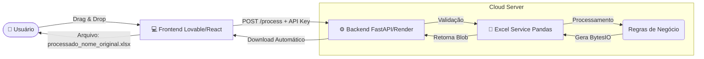

# Codex Excel Manipulation 🚀

Aplicação moderna para processamento e manipulação automatizada de planilhas Excel. Originalmente desenvolvida em Streamlit, este projeto foi migrado para uma arquitetura desacoplada (Headless), utilizando **FastAPI** no backend para alta performance e **Lovable (React)** para uma interface frontend moderna e responsiva.

## 🏗️ Arquitetura do Sistema

O sistema opera em duas camadas distintas, comunicando-se via API REST segura.



## 🛠️ Tech Stack

### Backend (API)

* **Language:** Python 3.10+
* **Framework:** FastAPI
* **Data Processing:** Pandas, OpenPyXL, XlsxWriter
* **Security:** API Key Authentication (Header `x-api-key`)
* **Deploy:** Render

### Frontend (Interface)

* **Platform:** Lovable
* **Framework:** React + TypeScript
* **Styling:** Tailwind CSS + Shadcn UI
* **Integration:** Fetch API com suporte a Blobs binários

## 🚀 Como Rodar Localmente (Backend)

1. **Clone o repositório**

```bash
git clone https://github.com/victorhprada/codex_excel_manipulation.git
cd codex_excel_manipulation
```

2. **Instale as dependências**

```bash
pip install -r requirements.txt
```

3. **Configure a Variável de Ambiente**

Crie um arquivo `.env` na raiz do projeto (copie de `.env.example`) ou exporte no terminal:

```bash
export API_KEY="sua_chave_secreta_aqui"
```

No Windows (PowerShell):

```powershell
$env:API_KEY="sua_chave_secreta_aqui"
```

4. **Inicie o Servidor**

```bash
uvicorn main:app --reload
```

A documentação interativa (Swagger) estará disponível em: **http://localhost:8000/docs**

## 🔐 API Endpoints

### `POST /process`

Processa o arquivo Excel enviado e retorna a versão modificada.

* **Header:** `x-api-key: <SUA_CHAVE>`
* **Body (form-data):** `file: <arquivo.xlsx>`
* **Response:** Arquivo binário (`application/vnd.openxmlformats-officedocument.spreadsheetml.sheet`)

### `GET /health`

Verifica se a API está online.

## 📄 Estrutura do Projeto

```
├── main.py                  # Entry point da API (Rotas e Auth)
├── services/
│   └── excel_processor.py   # Lógica pura de manipulação (Pandas)
├── requirements.txt         # Dependências do Python
├── .env.example             # Exemplo de variáveis de ambiente
└── README.md                # Documentação
```
